# Compte Rendu - TD 3 : Utiliser le CMS Headless Directus

Ce document détaille les étapes techniques, les commandes exécutées et les observations réalisées durant le TD.

## 1. Préparation de l'environnement

L'objectif initial était de mettre en place un environnement Directus conteneurisé comprenant une instance Directus et une base de données PostgreSQL.

### Analyse de la documentation

Avant de commencer, j'ai consulté la documentation officielle de Directus disponible à l'adresse : https://docs.directus.io/self-hosted/docker-guide.html

La documentation recommande l'utilisation de Docker Compose pour orchestrer les services nécessaires :
- **Directus** : Le CMS headless qui expose l'API REST et le backoffice d'administration
- **PostgreSQL** : La base de données relationnelle pour stocker les données

### Création des fichiers de configuration

#### Fichier docker-compose.yml

J'ai créé un fichier `docker-compose.yml` basé sur la documentation officielle avec les services suivants :

**Service postgres :**
- Image : `postgres:16`
- Base de données : `directus_pratilib` (nom personnalisé pour le projet)
- Utilisateur : `directus_user`
- Volume persistant pour les données
- Health check pour s'assurer que PostgreSQL est prêt avant de démarrer Directus

**Service directus :**
- Image : `directus/directus:11` (dernière version stable)
- Port exposé : `8055` (port par défaut de Directus)
- Configuration de connexion à PostgreSQL
- Volumes pour les uploads et extensions
- Dépendance sur le service postgres avec condition de santé

**Choix techniques :**
- Utilisation de variables d'environnement pour faciliter la personnalisation
- Health check sur PostgreSQL pour éviter les erreurs de connexion au démarrage
- Volumes nommés pour la persistance des données
- Réseau dédié pour l'isolation des services

#### Fichier .env

Pour personnaliser les données de connexion comme demandé dans le sujet, j'ai créé un fichier `.env` contenant :

```env
# Configuration de la base de données
DB_DATABASE=directus_pratilib
DB_USER=directus_user
DB_PASSWORD=directus_password_2026

# Configuration de l'administrateur Directus
ADMIN_EMAIL=your_admin_email
ADMIN_PASSWORD=your_admin_password

# Clé secrète Directus
SECRET=replace-with-random-secret-key-min-32-chars-long-abc123xyz
```

**Choix de personnalisation :**
- Nom de base de données évocateur : `directus_pratilib` (en lien avec le domaine des praticiens)
- Email admin : `your_admin_email`
- Mot de passe sécurisé avec majuscules, chiffres et caractères spéciaux
- La clé secrète devrait être remplacée par une valeur aléatoire en production

#### Fichier .gitignore

J'ai créé un fichier `.gitignore` pour éviter de versionner les données sensibles :
```
.env
img/
```

### Démarrage des services

J'ai lancé la construction et le démarrage des conteneurs avec la commande suivante :

```powershell
docker-compose up -d
```

**Observation :** Les deux conteneurs ont démarré correctement. Directus a automatiquement initialisé la base de données PostgreSQL et appliqué les migrations nécessaires au premier démarrage.

### Vérification du fonctionnement

1. **Statut des conteneurs :**
```powershell
docker-compose ps
```
*Résultat :* Les conteneurs `directus_app` et `directus_postgres` sont en état "Up" (et "Healthy" pour postgres).

2. **Accès au backoffice :**
L'interface d'administration est accessible à l'adresse `http://localhost:8055`.
J'ai pu vérifier que la page de connexion s'affiche correctement.

Dans le navigateur : 

3. **Connexion :**
Utilisation des identifiants définis dans le fichier `.env` :
- Email : `your_admin_email`
- Mot de passe : `your_admin_password!`

Page de setup : 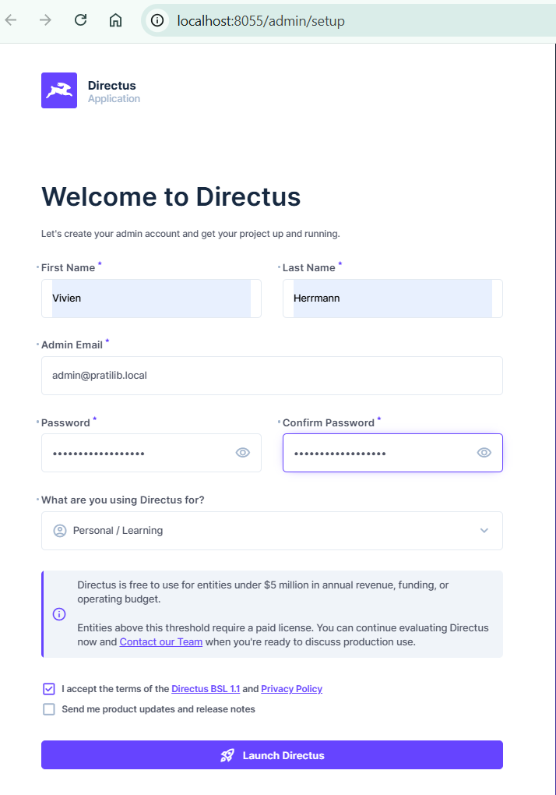
L'accès au tableau de bord est opérationnel.

---
## 2. Création des données

L'objectif de cette étape est de modéliser le domaine santé et d'insérer des données dans Directus.

### Modélisation du domaine

Le modèle de données correspond au schéma UML déduit des entités Doctrine du TD1. Il se compose de cinq collections principales et de leurs relations :

1. **Specialite** : Gère les spécialités médicales.
   - `id` : Entier (Auto-incrément) - Clé primaire.
   - `libelle` : Chaîne de caractères.
   - `description` : Texte long.

2. **Structure** : Gère les établissements de santé.
   - `id` : UUID - Clé primaire.
   - `nom` : Chaîne de caractères.
   - `adresse` : Texte long.
   - `ville` : Chaîne de caractères.
   - `code_postal` : Chaîne de caractères.
   - `telephone` : Chaîne de caractères.

3. **Praticien** : Gère les professionnels de santé.
   - `id` : UUID - Clé primaire.
   - `nom`, `prenom`, `ville`, `email`, `telephone`, `rpps_id`, `titre` : Chaîne de caractères.
   - `organisation`, `nouveau_patient` : Booléens.
   - `specialite_id` : Relation Many-to-One vers `specialite`.
   - `structure_id` : Relation Many-to-One vers `structure`.

4. **motif_visite** : Gère les motifs de consultation.
   - `id` : Entier (Auto-incrément) - Clé primaire.
   - `libelle` : Chaîne de caractères.
   - `specialite_id` : Relation Many-to-One vers `specialite`.

5. **moyen_paiement** : Gère les modes de règlement.
   - `id` : Entier (Auto-incrément) - Clé primaire.
   - `libelle` : Chaîne de caractères.

**Relations Many-to-Many :**
- Un **Praticien** peut accepter plusieurs **Moyens de Paiement** (via la table de jointure `praticien2moyen`).
- Un **Praticien** peut proposer plusieurs **Motifs de Visite** (via la table de jointure `praticien2motif`).

### Automatisation de la création du modèle

J'ai créer manuellement chaque collection et champ dans l'interface tel que :

1. Crée les collections avec leurs types de clés primaires respectifs.
2. Ajoute les champs nécessaires à chaque collection avec les interfaces Directus adaptées (input, textarea, boolean).
3. Configure les relations Many-to-One entre praticiens, spécialités et structures.


**Résultat** : 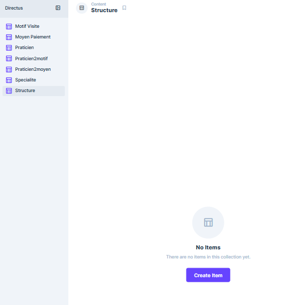

### Import des données

L'importation a été réalisée manuellement via l'interface de Directus en utilisant des fichiers CSV réalisés à la main et exportés.

Pour respecter l'intégrité des données et les relations entre les tables, l'importation a été effectuée dans l'ordre suivant :

1. **Niveau 1 (Indépendant)** : `specialite.csv`, `structure.csv`, `moyen_paiement.csv`
2. **Niveau 2 (Dépendances simples)** : `motif_visite.csv`, `practicien.csv`
3. **Niveau 3 (Tables de jointure)** : `praticien2motif.csv`, `praticien2moyen.csv`

### Vérification de l'import

Nous avons vérifié que les données ont bien été importées dans le CMS.

Résultat dans le navigateur **/content/motif_visite** : 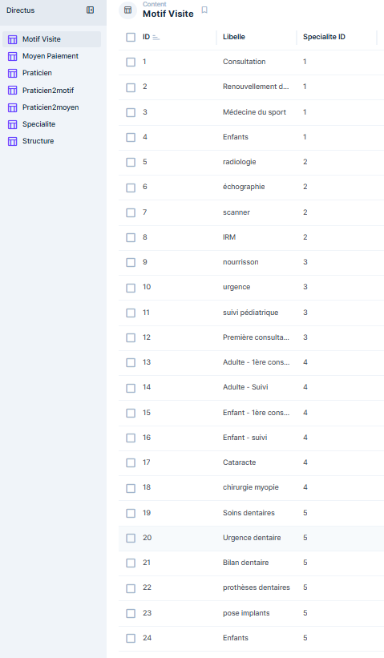

Résultat dans le navigateur **/content/praticien** : 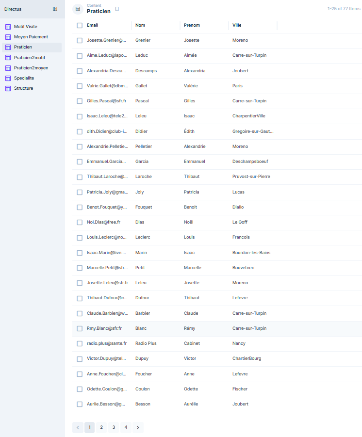

Résultat dans le navigateur **/content/structure** : 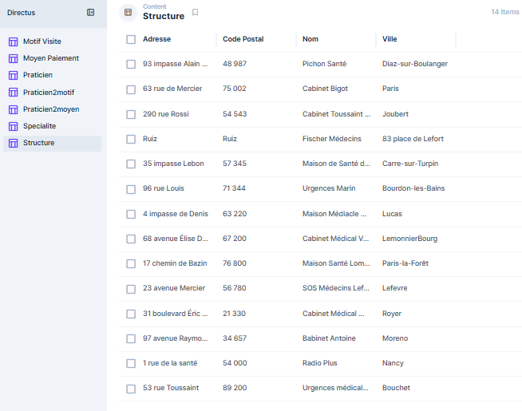


## 3. API REST

Dans cette phase finale, j'ai utilisé l'API REST de Directus pour effectuer les requêtes demandées.

### Configuration avancée du schéma

Pour permettre les requêtes complexes de type "Une structure et ses praticiens" (Requêtes 5, 6 et 7), il a fallu configurer des **relations inverses** (O2M) dans Directus. Par défaut, Directus ne permet pas de "remonter" une relation Many-to-One depuis le côté "One" sans définir un alias explicite.

> J'ai réalisées les relations inverses directement dans le Backoffice :
> 1. Aller dans **Paramètres** > **Modèle de données** > **Structure**.
> 2. Créer un champ de type **Alias** > **Alias M2O (One-to-Many)**.
> 3. Nommer le champ `praticiens` et sélectionner la collection `praticien` et le champ `structure_id`.

### Requêtes

J'ai réalisé les requêtes 1 à 7 via le navigateur et affiché les résultats JSON.

**Requete 1 : Liste des praticiens**
- **Objectif** : Récupérer la liste brute des praticiens.
- **URL** : `/items/praticien?limit=3` (Limité à 3 pour la visibilité).
- **Résultat** : 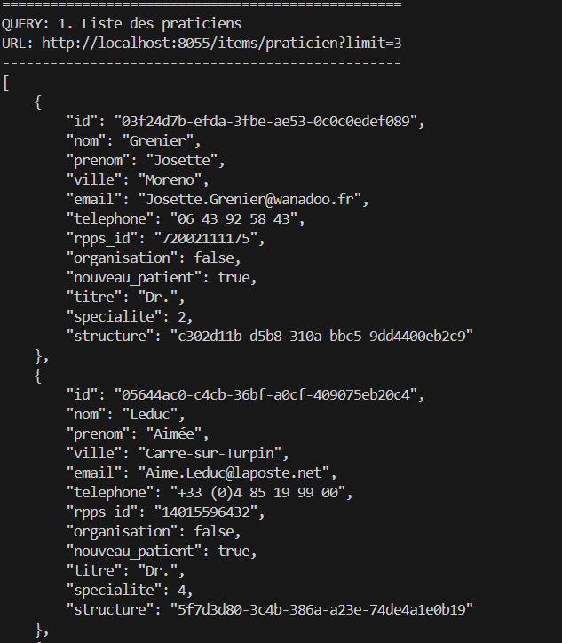

**Requete 2 : La spécialité d'ID 2**
- **Objectif** : Récupérer tous les détails d'une spécialité spécifique par son identifiant unique.
- **URL** : `/items/specialite/2`
- **Résultat** : 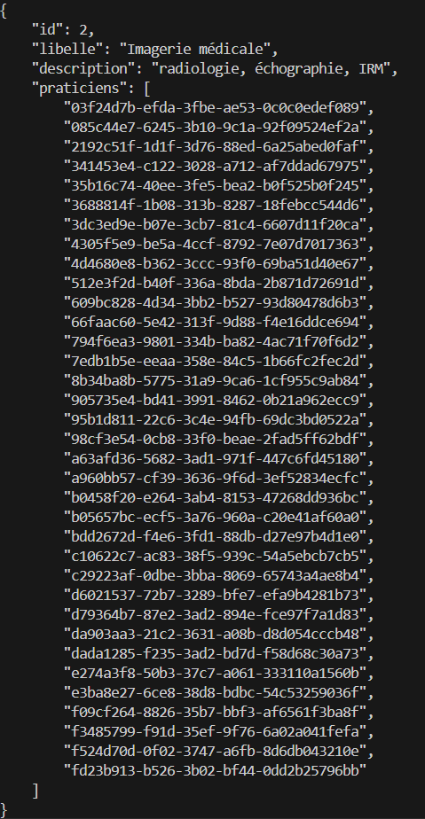

**Requete 3 : La spécialité d'ID 2 (libellé uniquement)**
- **Objectif** : Optimiser la requête pour ne récupérer que le champ indispensable.
- **URL** : `/items/specialite/2?fields=libelle`
- **Paramètre** : `fields=libelle` permet de filtrer la sortie JSON côte serveur.
- **Résultat** : 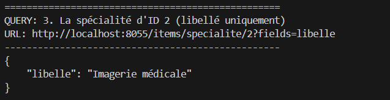

**Requete 4 : Un praticien avec sa spécialité (libellé)**
- **Objectif** : Effectuer une jointure simple pour récupérer le libellé de la spécialité liée à un praticien.
- **URL** : `/items/praticien?fields=nom,prenom,specialite_id.libelle&limit=1`
- **Syntaxe** : On utilise le point (`.`) pour accéder aux champs de la collection liée (`specialite_id.libelle`).
- **Résultat** : 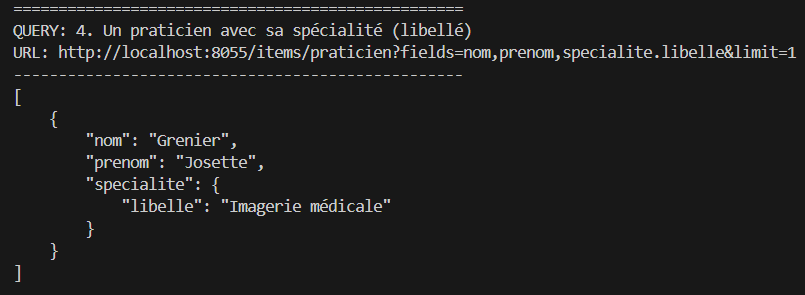

**Requete 5 : Une structure et la liste des praticiens rattachés**
- **Objectif** : Utiliser la relation inverse (O2M) pour lister les praticiens d'une structure donnée.
- **URL** : `/items/structure?fields=nom,ville,praticiens.nom,praticiens.prenom&limit=1`
- **Condition** : Nécessite l'alias `praticiens` configuré dans le modèle de données de la collection `structure`.
- **Résultat** : 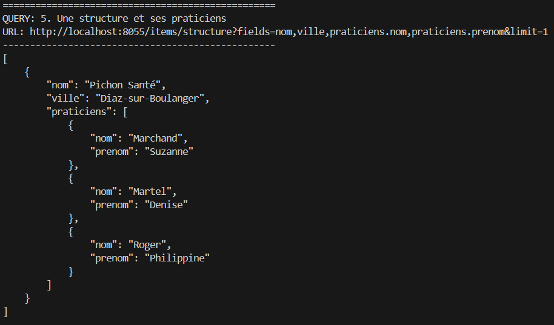

**Requete 6 : Structure, praticiens et leurs spécialités respectives**
- **Objectif** : Effectuer une requête "profonde" (Deep fetching) sur trois niveaux de relations.
- **URL** : `/items/structure?fields=nom,ville,praticiens.nom,praticiens.prenom,praticiens.specialite_id.libelle&limit=1`
- **Résultat** : 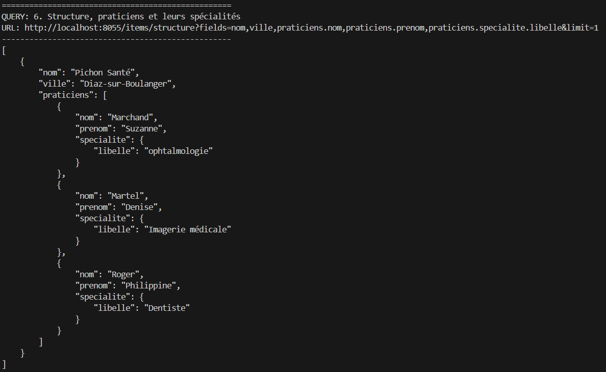

**Requete 7 : Les structures dont la ville contient "sur"**
- **Objectif** : Filtrer les résultats sur un champ spécifique avec un opérateur de comparaison (`_contains`).
- **URL** : `/items/structure?filter={"ville":{"_contains":"sur"}}&fields=nom,ville,praticiens.nom,praticiens.prenom,praticiens.specialite_id.libelle`
- **Filtre** : Permet de cibler les structures situées dans des villes comme "Diaz-sur-Boulanger" ou "Carre-sur-Turpin".
- **Résultat** : 


### Conclusion

Le TD est terminé. Toutes les étapes ont été validées :
1. Installation et configuration de Directus via Docker.
2. Modélisation et import manuel des données via CSV (77 praticiens).
3. Interrogation de l'API REST via PHP avec gestion des relations profondes et des filtres.