# TD4 - Directus CMS - GraphQL

## Objectif
Ce TD a pour but de découvrir et maîtriser l'API GraphQL de Directus. Nous allons effectuer des requêtes de lecture (Query), gérer les autorisations via des rôles et policies, et réaliser des mutations pour modifier les données.

## Prérequis
- Instance Directus fonctionnelle (issue du TD3).
- Collections et données existantes (`praticien`, `specialite`, `structure`, etc.).
- Client API GraphQL : J'ai utilisé **Postman**.

> **Récupérer son token Admin via Postman** :
  > 1.  Requête **POST** sur `http://localhost:8055/auth/login`
  > 2.  **Body** (Type: JSON) :
  >    ```json
  >    {
  >      "email": "votre@email.admin",
  >      "password": "votre_mot_de_passe"
  >    }
  >    ```
  > 3.  Le token se trouve dans la réponse JSON sous la clé `data.access_token`.
  > Le résultat ressemble à 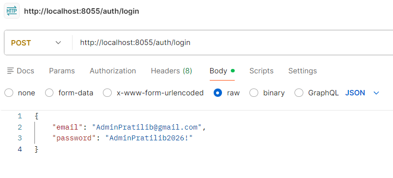
  
  > **Requêtage Postman** :
  > 1.  Créer une requête **POST**.
  > 2.  URL : `http://localhost:8055/graphql`
  > 3.  **Authorization** : avec Auth Type "Bearer Token" -> coller votre token admin.
  > 4.  **Rendu settings** : 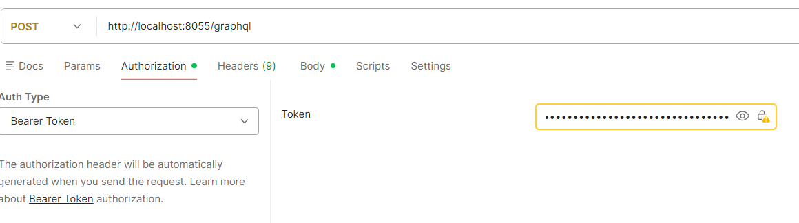
  > 5.  **Body** : Sélectionner "GraphQL".
  > 6.  Dans la zone "Query", copiez votre requête (`query { ... }`).
  > 7.  **Exemple** de rendu de la requête (exemple avec requête 1):  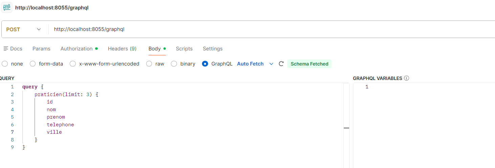


## Plan de travail

### 1. Requêtes GraphQL (Query)
Nous allons implémenter 10 requêtes de lecture progressive.

---
## 1. Requêtes GraphQL (Queries)

### Requete 1 : Liste simple des praticiens
- **Objectif** : Récupérer id, nom, prenom, tel, ville.
- **GraphQL** :
```graphql
query {
    praticien(limit: 3) {
        id
        nom
        prenom
        telephone
        ville
    }
}
```
- **Résultat** :
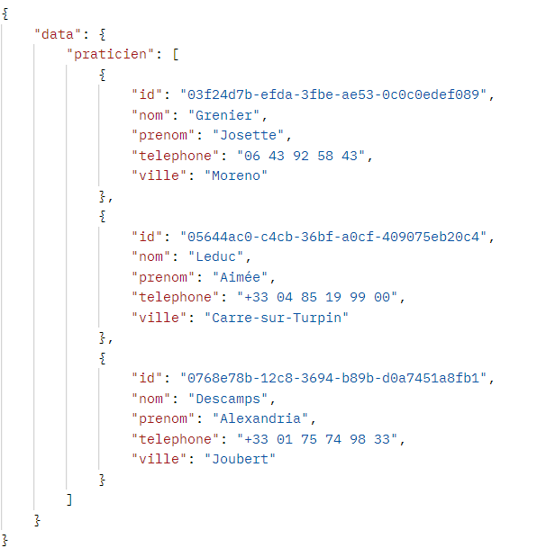

### Requete 2 : Ajout du libellé de la spécialité
- **Objectif** : Afficher le libellé de la spécialité du praticien.
- **GraphQL** :
```graphql
query {
    praticien(limit: 3) {
        id
        nom
        prenom
        telephone
        ville
        specialite_id {
            libelle
        }
    }
}
```
- **Résultat** :
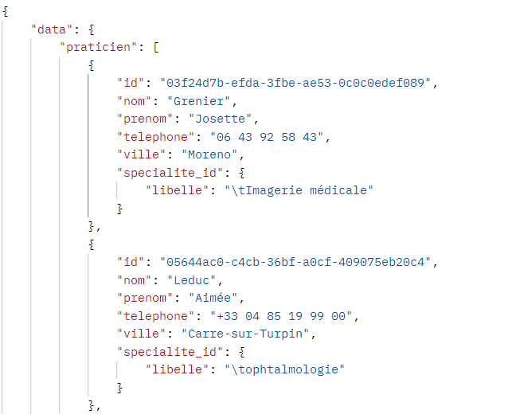

### Requete 3 : Filtre ville = "Paris"
- **Objectif** : Sélectionner les praticiens dont la ville est "Paris".
- **GraphQL** :
```graphql
query {
    praticien(filter: { ville: { _eq: "Paris" } }, limit: 3) {
        id
        nom
        ville
    }
}
```
- **Résultat** :
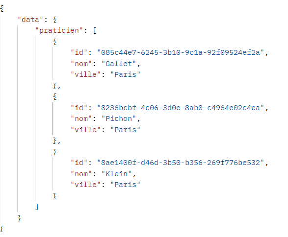

### Requete 4 : Ajout structure (nom, ville)
- **Objectif** : Ajouter les infos de la structure d'appartenance.
- **GraphQL** :
```graphql
query {
    praticien(filter: { ville: { _eq: "Paris" } }, limit: 3) {
        nom
        structure_id {
            nom
            ville
        }
    }
}

```
- **Résultat** :
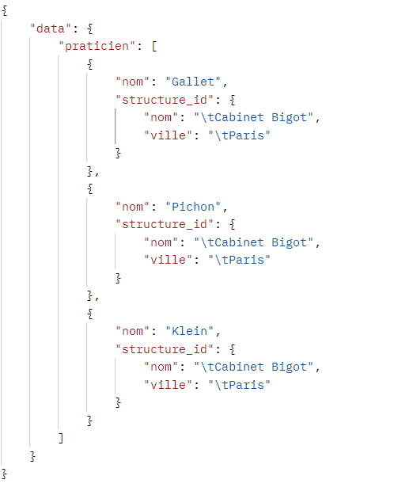

### Requete 5 : Filtre email contient ".fr"
- **Objectif** : Retenir les emails contenant ".fr".
- **GraphQL** :
```graphql
query {
    praticien(filter: { email: { _contains: ".fr" } }, limit: 3) {
        nom
        email
    }
}
```
- **Résultat** :
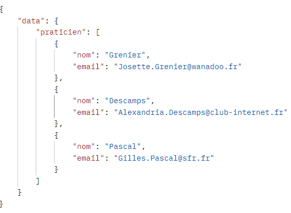
### Requete 6 : Praticiens d'une structure à "Paris"
- **Objectif** : Lister les praticiens rattachés à une structure dont la ville est "Paris".
- **GraphQL** :
```graphql
query {
    praticien(filter: { structure_id: { ville: { _contains: "Paris" } } }, limit: 3) {
        nom
        structure_id {
            nom
            ville
        }
    }
}
```
- **Résultat** :
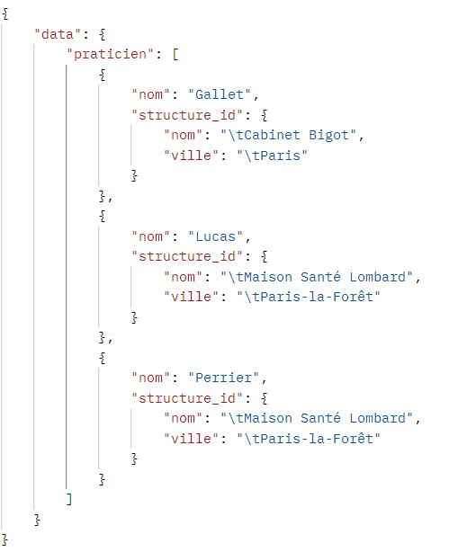

### Requete 7 : Requête avec Alias
- **Objectif** : Retourner une liste de praticiens installés à Paris et une liste de praticiens installés à Bourdon-les-Bains en utilisant des alias.
- **GraphQL** :
```graphql
query {
    Paris: praticien(filter: { ville: { _eq: "Paris" } }, limit: 2) {
        nom
        ville
    }
    Bourdon: praticien(filter: { ville: { _eq: "Bourdon-les-Bains" } }, limit: 2) {
        nom
        ville
    }
}
```
- **Résultat** :
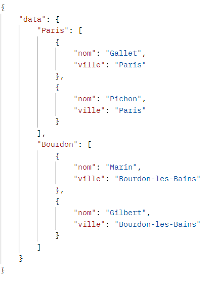

### Requete 8 : Utilisation de Fragment
- **Objectif** : Transformer la requête précédente de façon à utiliser un fragment correspondant aux champs du résultat.
- **GraphQL** :
```graphql
query {
    Paris: praticien(filter: { ville: { _eq: "Paris" } }, limit: 2) {
        ...praticienFields
    }
    Bourdon: praticien(filter: { ville: { _eq: "Bourdon-les-Bains" } }, limit: 2) {
        ...praticienFields
    }
}

fragment praticienFields on praticien {
    nom
    ville
}
```
- **Résultat** :
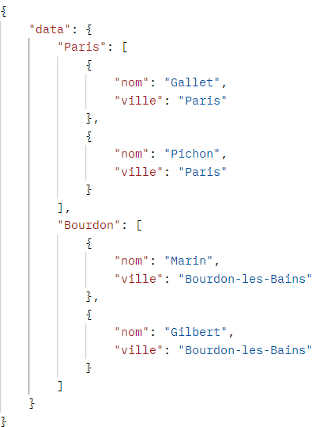

### Requete 9 : Utilisation de Variable
- **Objectif** : Transformer la requête 3 pour utiliser une variable de façon à paramétrer la requête par le nom de la ville souhaitée.
- **GraphQL** :
```graphql
query($ville: String!) {
    praticien(filter: { ville: { _eq: $ville } }, limit: 3) {
        id
        nom
        ville
    }
}
```
- **Variables** :
```json
{
  "ville": "Paris"
}
```
- **Résultat** :
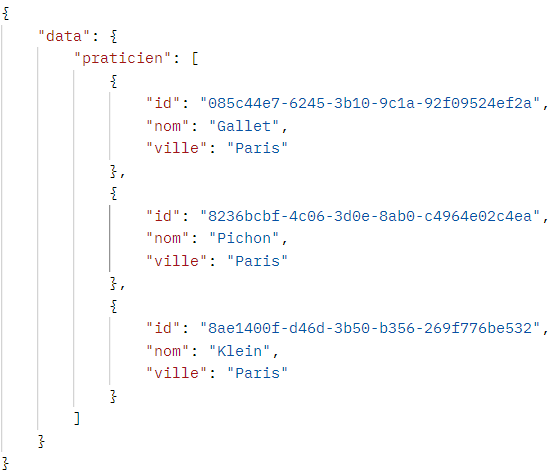

### Requete 10 : Liste des structures et praticiens (Nested)
- **Objectif** : Liste des structures (nom et ville) avec la liste des praticiens attachés (nom, prénom, email, spécialité).
- **GraphQL** :
```graphql
query {
    structure(limit: 2) {
        nom
        ville
        praticiens {
            nom
            prenom
            email
            specialite_id {
                libelle
            }
        }
    }
}
```
Résultat :
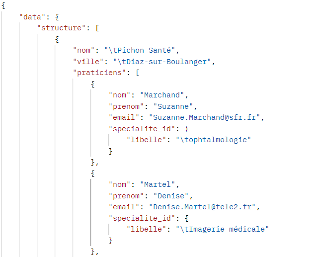
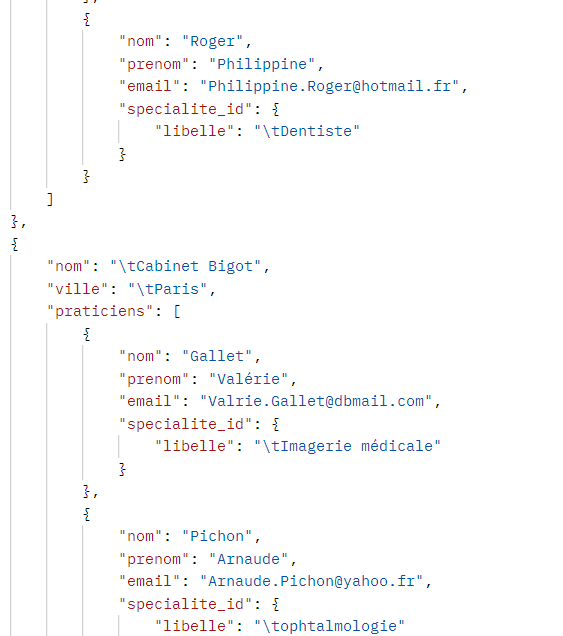
---

## 2. Autorisations dans Directus

L'objectif est de sécuriser l'accès aux données en créant des profils spécifiques et en restreignant l'accès public.
### Étape 1 : Création des utilisateurs
1.  Aller dans **User Directory** > **Users**.
2.  **Utilisateur 1 (Token Statique)** :
    *   Cliquer sur **+ Create User**.
    *   Email : `user.static@pratilib.fr`
    *   Dans la section **Token**, renseigner une valeur fixe générée aléatoirement.
    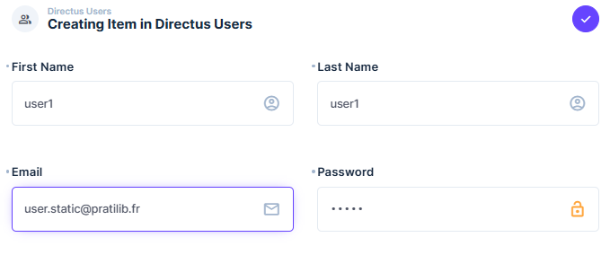
    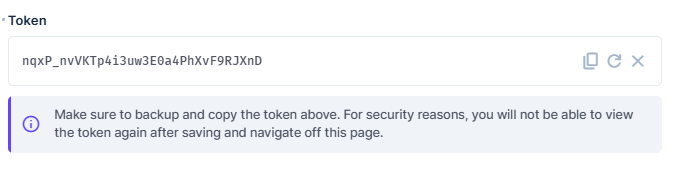
3.  **Utilisateur 2 (Authentification JWT)** :
    *   Cliquer sur **+ Create User**.
    *   Email : `user.jwt@pratilib.fr`, Password : `password`.
    *   *(Cet utilisateur utilisera l'endpoint `/auth/login` pour obtenir un token dynamique via **Postman** par exemple).
    * 

### Étape 2 : Création du Rôle et de la Policy
1.  Aller dans **Settings** (Paramètres) > **User Directory** > **Roles**.
2.  Cliquer sur **+ Create Role** et nommer le "API TD4".
3.  Créer des nouvelles **Permissions** :
    *   Cliquer sur l'icône de la collection **praticien**, **specialite**, **structure**, **motif_visite** et **moyen_paiement**.
    *   Pour l'action **Read**, sélectionner **All Access** pour les collections du projet
    * Cette permission doit être attribuée au **user_jwt**
    * Faire une **deuxième permission** pour **user_static** équivalente en ajoutant pour la collection `directus_users` :
        *   l'action **Update**, on permet un accès limité à cet user en reprenant son id et en accédant au champs Token 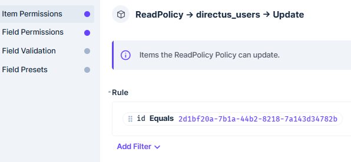
        
    * **Rendu Permissions** :
    - pour user_jwt : 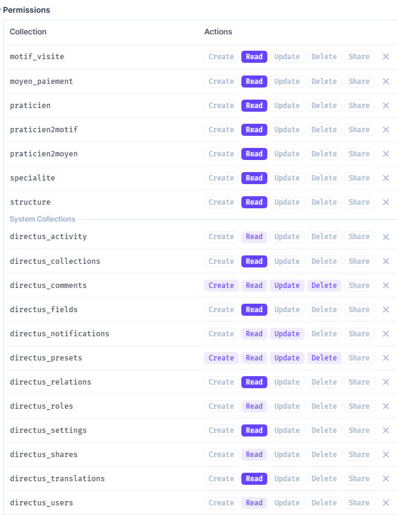
    - pour user_static : 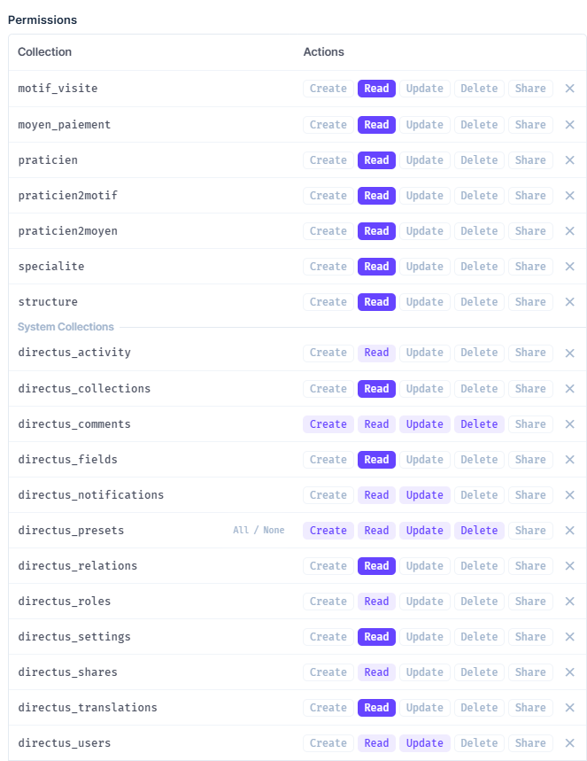

4.  Ajouter les utilisateurs au rôle :
    *   Cliquer sur **+ Add User**.
    *   Sélectionner les utilisateurs.
5.  **Rendu Role** :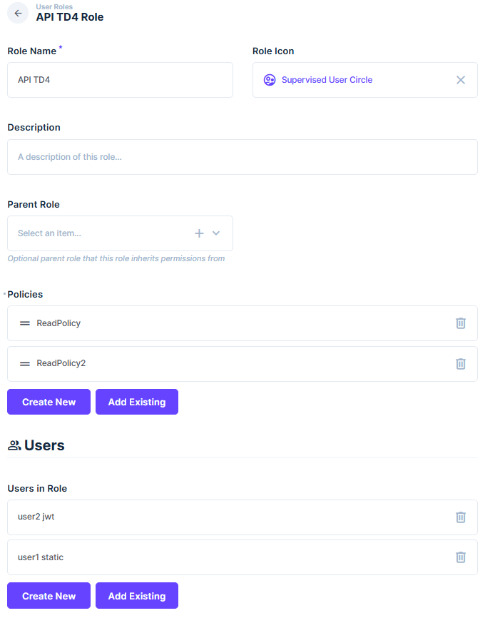

### Étape 3 : Restriction du rôle 'Public'
1.  Aller dans **Roles** > **Public**.
2.  S'assurer que pour les collections `motif_visite` et `moyen_paiement`, l'autorisation **Read** est désactivée (Croix rouge).
3.  **Rendu Permissions pour le rôle Public** :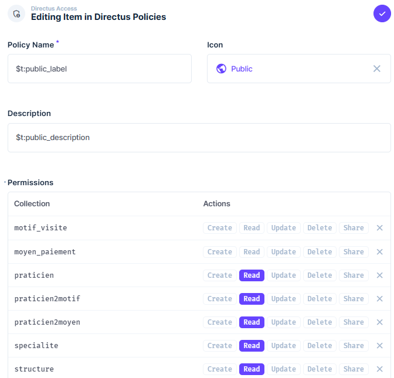


### Rendu global des roles :
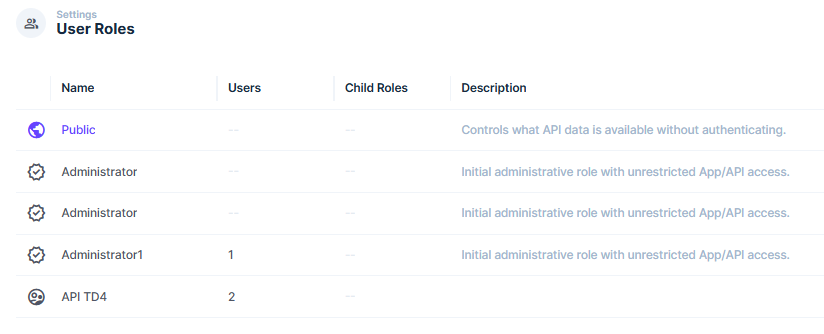
---

## 3. Vérification des accès

### 1. Test sans authentification (Public)
Tentative de lister les moyens de paiement sans header `Authorization`.
- **Requête** : `POST /graphql` avec `query { moyen_paiement { libelle } }`
- **Resultat attendu** : Erreur `FORBIDDEN` ou collection introuvable
- **Résultat** : 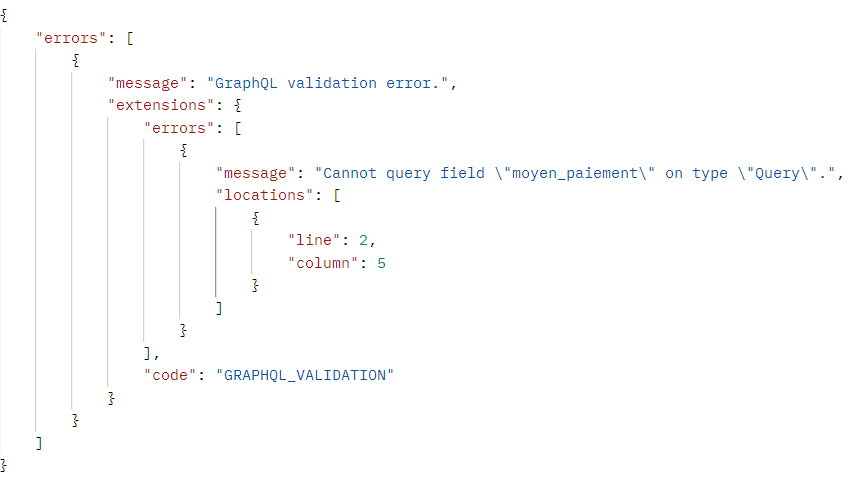

### 2. Test avec Token Statique
- **Header** : `Authorization: Bearer <STATIC_TOKEN>`
- **Attention** : Pour le **Token Statique** : N'essayez pas de vous connecter via `/auth/login`. Le token statique s'utilise DIRECTEMENT dans le header `Authorization`.
- **Requête** : `POST /graphql` avec `query { moyen_paiement { libelle } }`
- **Résultat attendu** : Succès.
- **Résultat** : 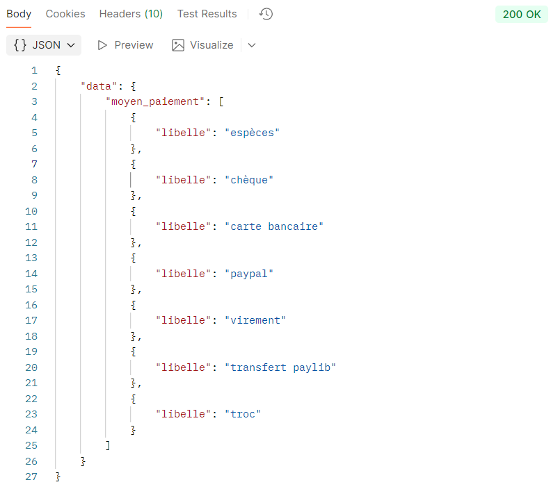

### 3. Test avec Token JWT
1.  Récupérer le token : `POST /auth/login` avec les email et password de `user.jwt`.
2.  Injecter le token dans Postman (`Authorization: Bearer <TOKEN>`).
3.  Exécuter la requête :
```graphql
query {
  motif_visite {
    libelle
    specialite_id {
      libelle
    }
  }
}
```
- **Résultat attendu** : Succès.
- **Résultat** : 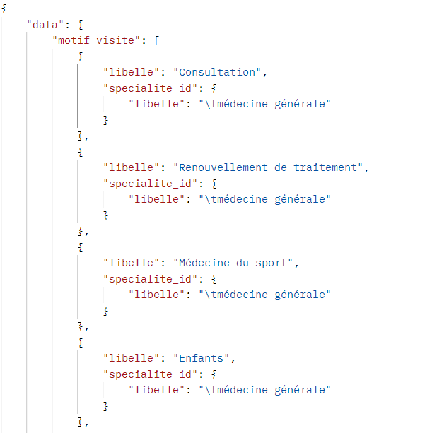

---

## 4. Mutations GraphQL

Les mutations permettent de modifier les données sur le serveur (Création, Modification, Suppression).

### Étape préalable : Ajustement des Permissions
Pour que ces requêtes fonctionnent via Postman avec votre utilisateur, vous devez ajouter les droits suivants au rôle **API TD4** :
- **Create** : Pour `praticien` et `specialite`.
- **Update** : Pour `praticien`.
- **Delete** : Pour `praticien`.

Rendu des permissions update : 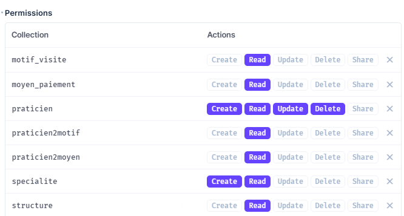

---

### Mutation 1 : Créer la spécialité «cardiologie»
- **GraphQL** :
```graphql
mutation {
  create_specialite_item(data: { libelle: "cardiologie" }) {
    id
    libelle
  }
}
```
- **Résultat** : 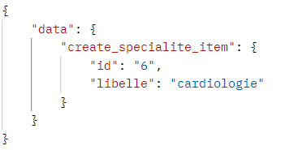

### Mutation 2 : Créer un praticien (infos de base)
- **GraphQL** :
```graphql
mutation {
  create_praticien_item(data: {
    id: "99999999-0000-0000-0000-000000000001",
    nom: "DUMONT",
    prenom: "Jean",
    ville: "Lyon",
    email: "jean.dumont@test.com",
    telephone: "0400000000"
  }) {
    id
    nom
  }
}
```
- **Résultat** : 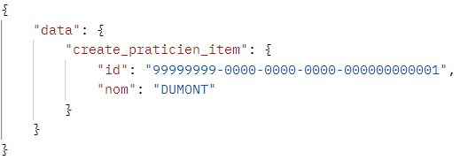

### Mutation 3 : Rattacher le praticien à la spécialité «cardiologie»
*Utilisez l'ID retourné à l'étape 1 pour la spécialité et l'ID du praticien de l'étape 2.*
- **GraphQL** :
```graphql
mutation {
  update_praticien_item(id: "99999999-0000-0000-0000-000000000001", data: {
    specialite_id: 6
  }) {
    id
    nom
    specialite_id { libelle }
  }
}
```
- **Résultat** : 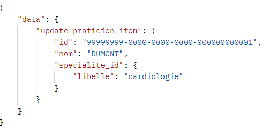

### Mutation 4 : Créer un praticien directement lié à la «cardiologie»
- **GraphQL** :
```graphql
mutation {
  create_praticien_item(
    data: {
      id: "99999999-0000-0000-0000-000000000002"
      nom: "VALENTIN"
      prenom: "Lucie"
      ville: "Paris"
      specialite_id: {
        id: 6
      }
    }
  ) {
    id
    nom
    specialite_id {
      id
      libelle
    }
  }
}
```
- **Résultat** : 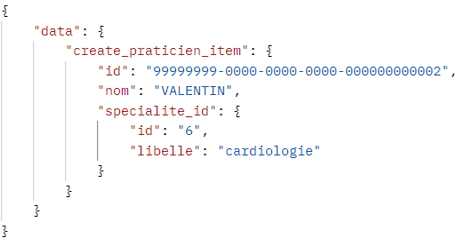

### Mutation 5 : Création imbriquée (Praticien + nouvelle Spécialité «chirurgie»)
- **GraphQL** :
```graphql
mutation {
  create_praticien_item(data: {
    id: "99999999-0000-0000-0000-000000000003",
    nom: "SIMON",
    prenom: "Etienne",
    specialite_id: {
      libelle: "chirurgie"
    }
  }) {
    id
    nom
    specialite_id {
      id
      libelle
    }
  }
}
```
- **Résultat** : 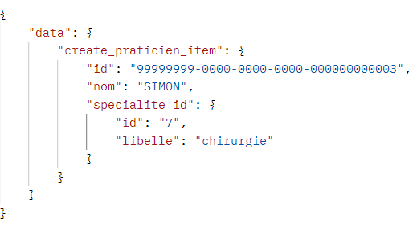

### Mutation 6 : Ajouter un praticien à la spécialité «chirurgie»
- **GraphQL** :
```graphql
mutation {
  create_praticien_item(data: {
    id: "99999999-0000-0000-0000-000000000004",
    nom: "RENAUD",
    prenom: "Marie",
    specialite_id: 7
  }) {
    id
    nom
  }
}
```
- **Résultat** : 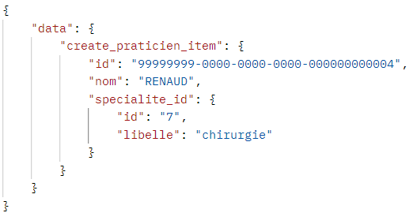

### Mutation 7 : Rattacher le 1er praticien créé à une structure existante (par exemple : "Cabinet Bigot")
- **GraphQL** :
```graphql
mutation {
  update_praticien_item(id: "99999999-0000-0000-0000-000000000001", data: {
    structure_id: "3444bdd2-8783-3aed-9a5e-4d298d2a2d7c"
  }) {
    id
    structure_id { nom }
  }
}
```
- **Résultat** : 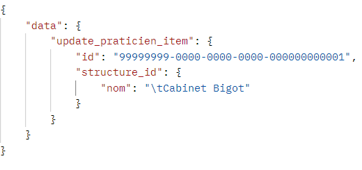

### Mutation 8 : Supprimer les deux derniers praticiens créés
*Utilisez les IDs des praticiens créés aux étapes 5 et 6.*
- **GraphQL** :
```graphql
mutation {
  delete_praticien_items(ids: ["99999999-0000-0000-0000-000000000003", "99999999-0000-0000-0000-000000000004"]) {
    ids
  }
}
```
- **Résultat** : 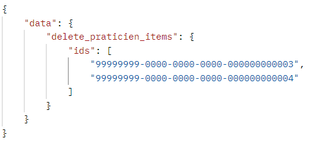

